# FatLess — Intelligent Fitness Ecosystem & Background Tracker 🐘

Профессиональный фитнес-комбайн для комплексного контроля физической формы, ведения дневника питания (БЖУК) и отслеживания активности. Проект спроектирован как отказоустойчивое фоновое решение с приоритетом на точность данных и максимальную живучесть системных сервисов в условиях агрессивного энергосбережения кастомных прошивок (MIUI/HyperOS).

## 🔋 Core Features (Функциональные модули):

*   **Интеллектуальный подсчет БЖУК**: Полноценный дневник питания с базой продуктов и автоматическим расчетом баланса белков, жиров, углеводов и калорий. Внедрен умный алгоритм динамического пересчета дефицита калорий «на лету» в зависимости от текущей фоновой активности пользователя.
*   **Конструктор и трекер тренировок**: Модуль создания, планирования и выполнения кастомных комплексов упражнений. Позволяет гибко настраивать интервалы активности, подходы и отслеживать прогресс выполнения в реальном времени.
*   **Дневник активности и календарь истории**: Интерактивный архив с календарем для ретроспективного анализа показателей за любой день. Хранит подробную почасовую статистику шагов, сожженных калорий и выполненных тренировок.
*   **Predictive Geofencing («Пивной дозор»)**: Модуль контекстных уведомлений на базе GPS-координат. Проверяет радиус (метод `distanceTo`) до сохраненных POI-точек и генерирует смарт-напоминания о покупках (или запланированных визитах, например, в салон красоты) по текущему маршруту пользователя.

## 🚀 Key Technical Highlights (Технический стек):

*   **Real-time Foreground Engine**: Кастомный фоновый `StepService` (Health type) на базе аппаратного датчика `Sensor.TYPE_STEP_COUNTER` с почасовым батчингом дельт.
*   **Anti-Kill Engine (Живучесть в фоне)**: Внедрена связка `Partial WakeLock` и периодического `StepRestartWorker` (WorkManager) с автоматизированным запросом системного разрешения `IGNORE_BATTERY_OPTIMIZATIONS`. Это позволило обойти жесткие ограничения Doze Mode и принудительное уничтожение процессов (Force Stop/Крестик) оптимизаторами памяти.
*   **Адаптивный GPS-трекинг**: Реализован чистый `LocationManager` с динамическим изменением шлюза точности (`accuracy` от 30м до 100м) и фильтра дистанции на основе скорости движения. Решена проблема потери точек (эффект "пунктирного трека") из-за экранирования сигнала внутри металлического вагона поезда.
*   **Glance Widgets**: Интерактивный виджет рабочего стола на базе Jetpack Glance с событийно-ориентированным обновлением данных из фонового процесса. Применен троттлинг (обновление каждые 10 шагов) для защиты от блокировок IPC-интерфейса Android.
*   **BLE Stack (Reverse Engineering)**: Реверс-инжиниринг проприетарного Bluetooth-протокола спортивного трекера Anicall. Собственная реализация работы с кастомными характеристиками и обработка аномалий GATT-стека (ошибка 133).

## 🏛 Архитектура проекта:
*   **Clean Architecture + MVVM / MVI** с четким разделением слоев (Data, Domain, UI).
*   **Jetpack Compose** для построения реактивного интерфейса.
*   **Room Database**: Многотабличная БД со сложной структурой связей (Одно-ко-многим, Многие-ко-многим) для сквозного хранения справочника продуктов, списка покупок, POI-точек и истории активности.
*   **Hilt** для чистого внедрения зависимостей (Dependency Injection).
*   **Thread Safety**: Обработка датчиков вынесена в `Dispatchers.Default`, тяжелая работа с базой данных — в `Dispatchers.IO` через кастомный `serviceScope` с `SupervisorJob`.

## 💼 Контакты:
Готов к обсуждению сложных архитектурных вызовов, работы с системными сервисами, Bluetooth LE, базами данных и оптимизации фоновых процессов под Android.

## 📸 Галерея интерфейса / Скриншоты (UI & UX Gallery)

### 📊 Главный экран и Мониторинг активности (Dashboard & Metrics)

  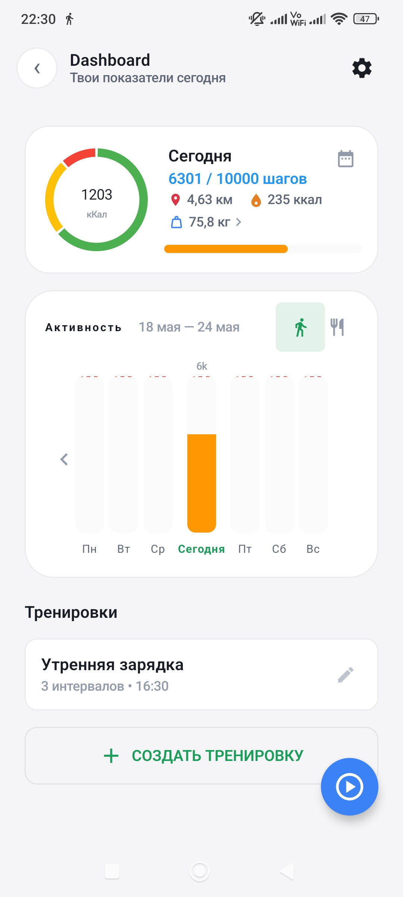
  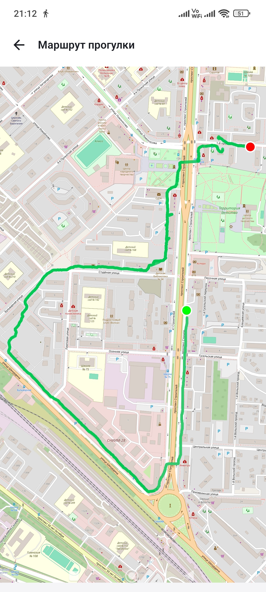
  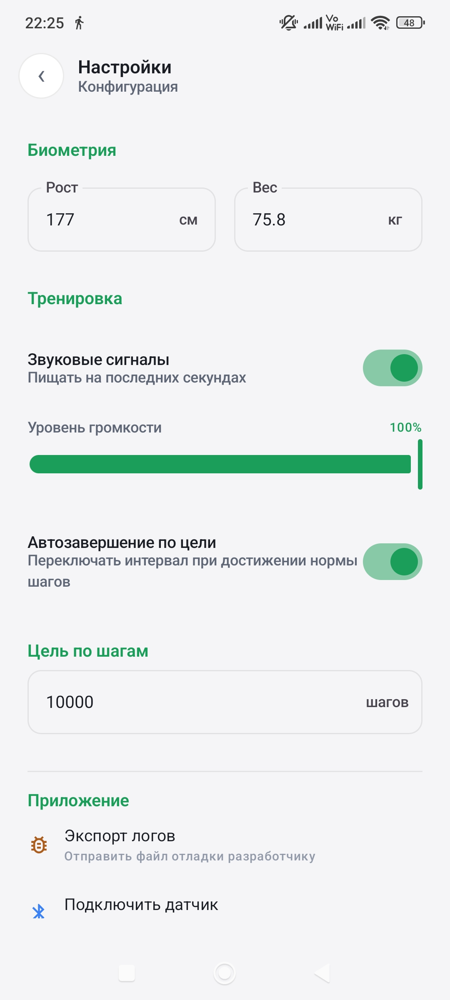

### 🍏 Дневник питания и База продуктов (Nutrition & Calorie Tracker)

  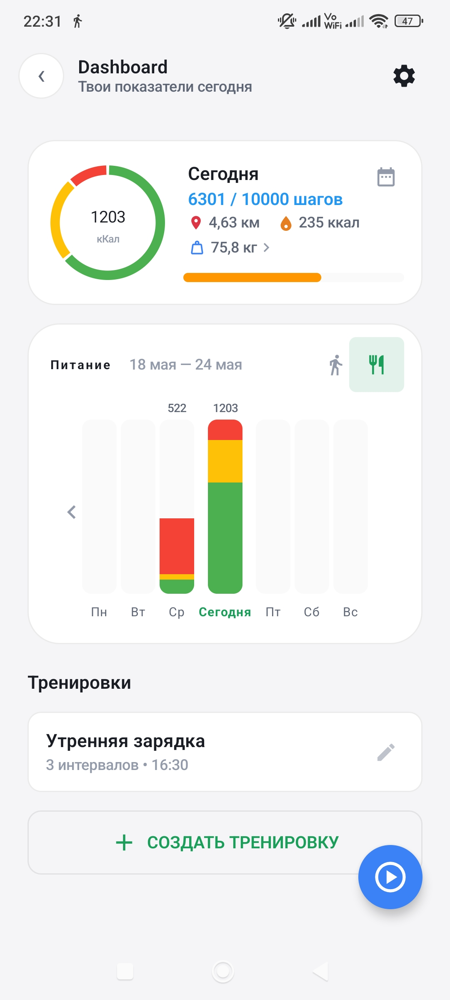
  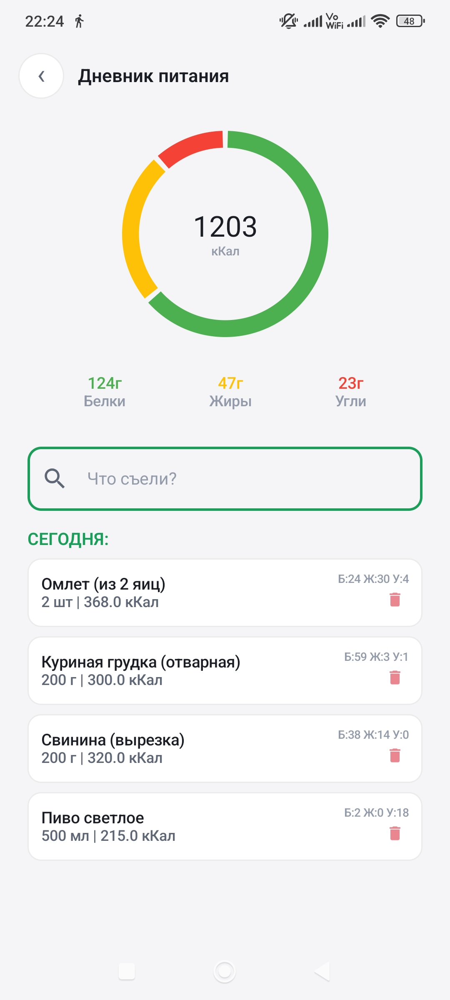
  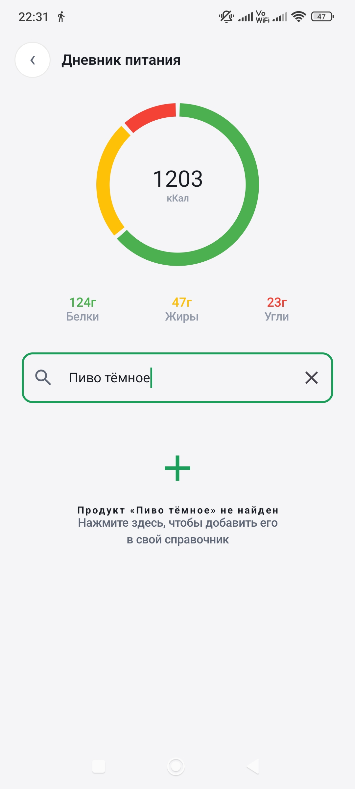
  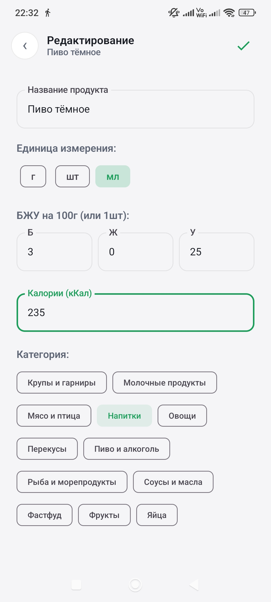

### 🏋️‍♂️ Конструктор тренировок и Выполнение упражнений (Workouts & Training)

  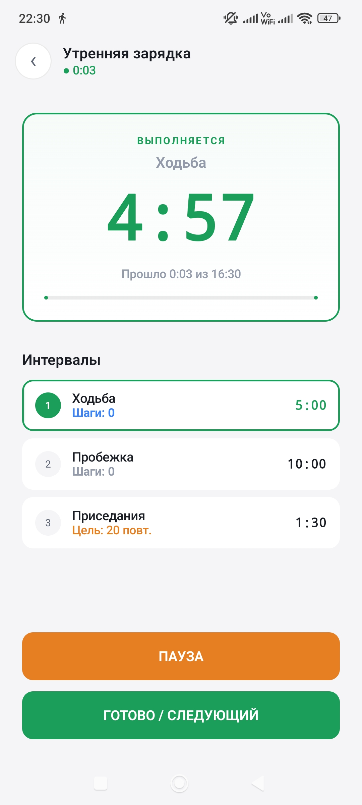
  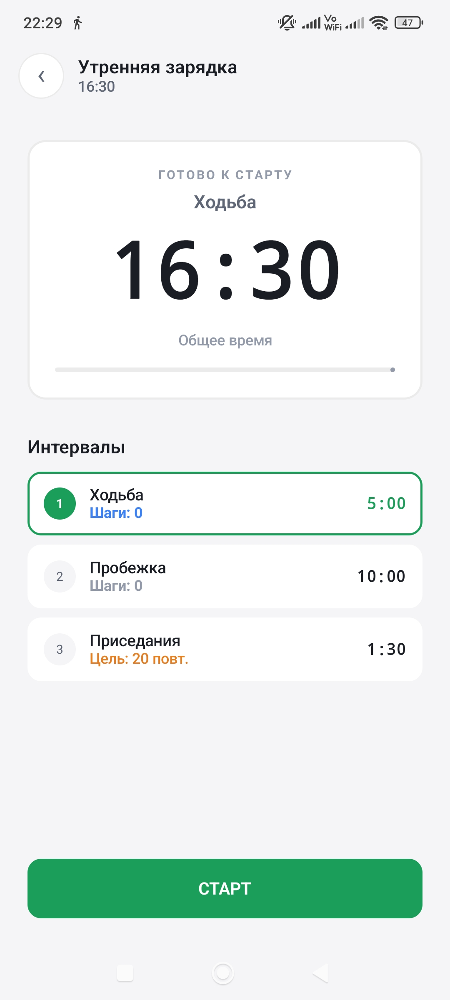
  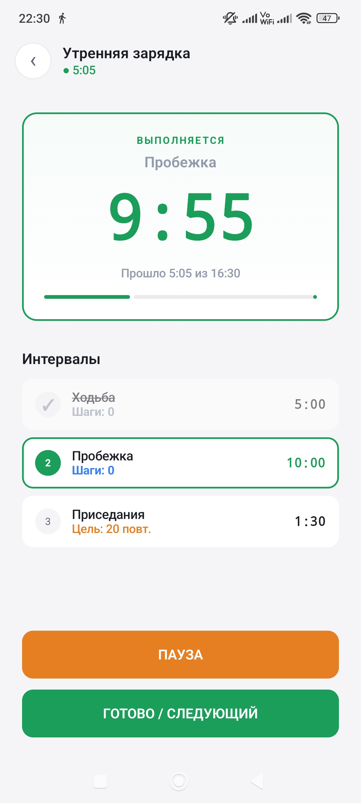
  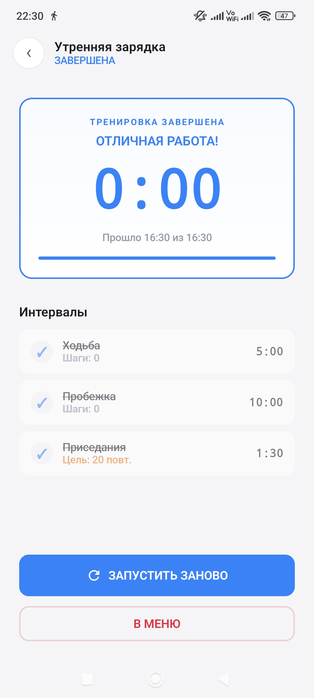

  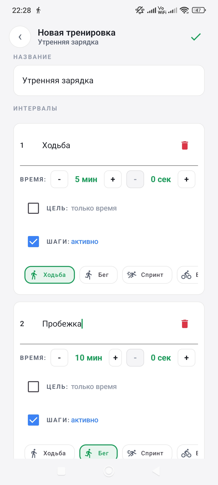
  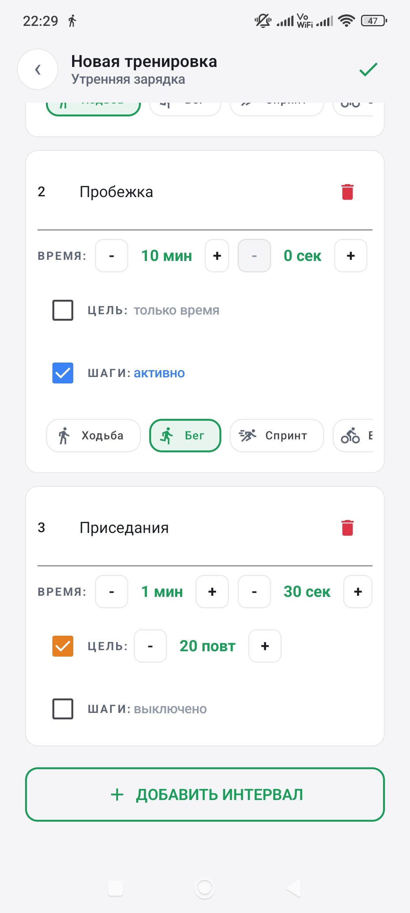

### 📅 Календарь истории (History Archive)

  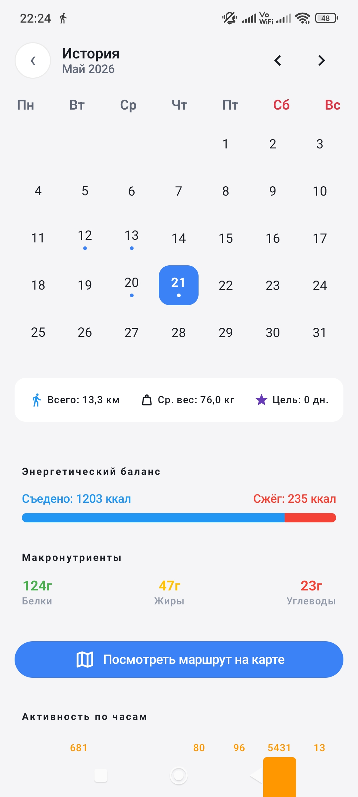
  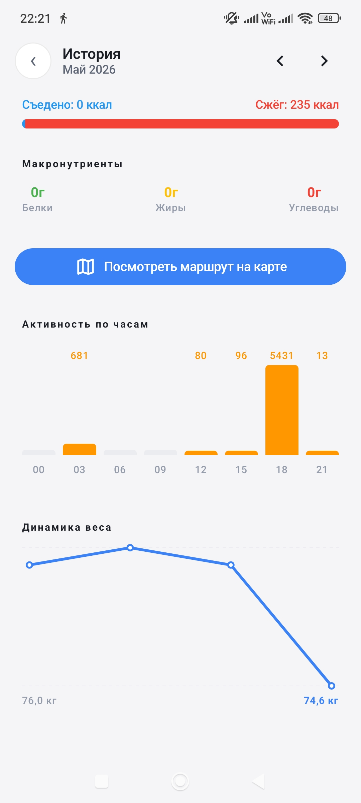

### 🔔 Системный контур и Уведомления (Foreground Services & Notifications)

  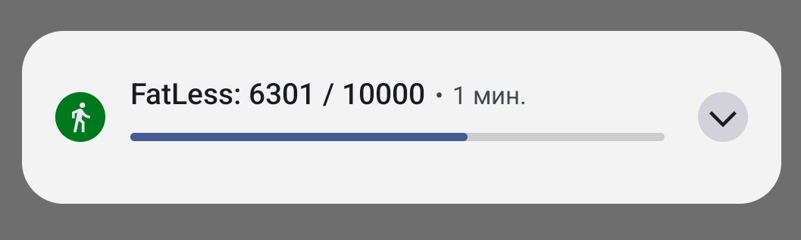
  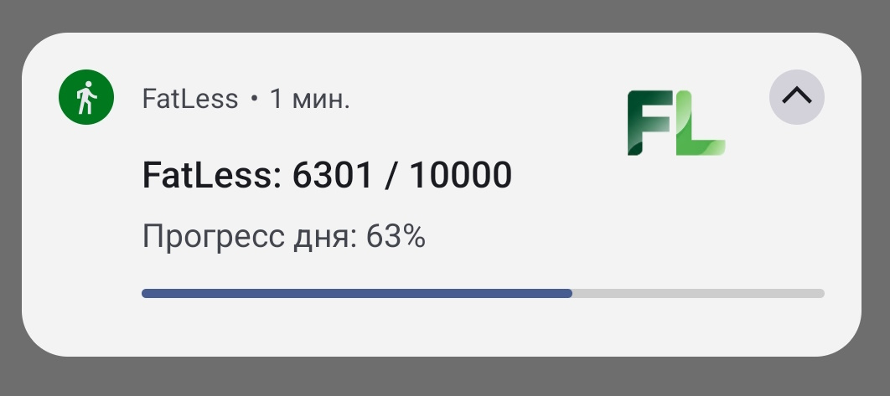
  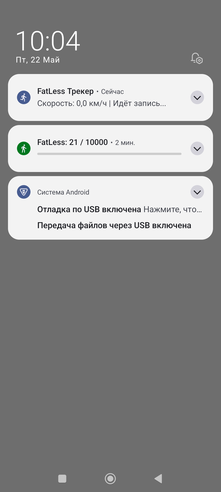

